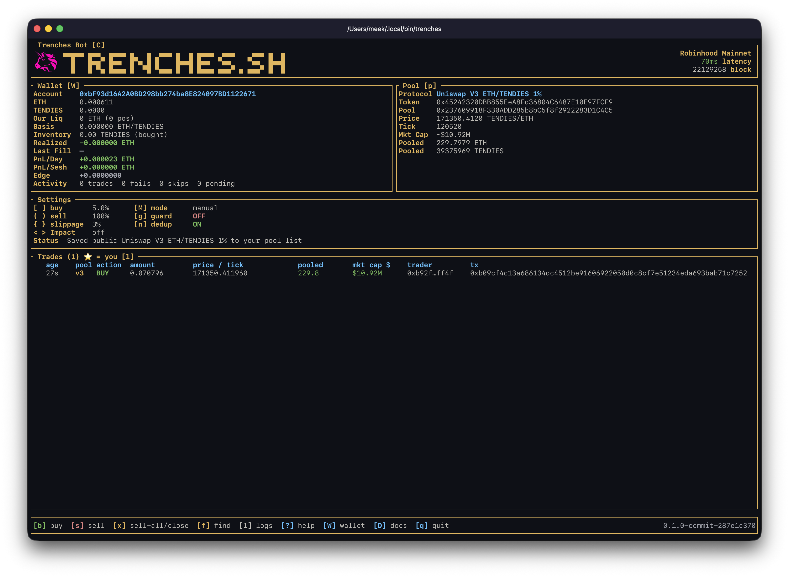

# Trenches

A terminal bot for trading memecoins.

**[trenches.sh](https://trenches.sh)**

> **the trenches** *(n.)* — where memecoins launch, run and die by the minute:
> the fastest and riskiest corner of crypto.
>
> **trencher** *(n.)* — "someone who spends a lot of time hunting and trading
> newly launched meme coins in the 'trenches'—the high-risk, high-volatility
> part of crypto." — *ChatGPT*
>
> This is their terminal.



- **Robinhood Chain** — Uniswap V3 and V4, [pons.family](https://pons.family)
  launches, [Flaunch](https://flaunch.gg) launches, [Flap](https://flap.sh)
  launches, and [pools.fun](https://pools.fun) launches trading on SushiSwap V3
- **BNB Chain** — [Flap](https://flap.sh) bonding curves and their graduation
  into PancakeSwap V3, plus Uniswap V3 and V4
- **Base** — Flaunch launches, Uniswap V3 and V4
- **Solana** — pump.fun bonding curves and PumpSwap AMM
- Keys stay on your machine, in a password-encrypted keystore
- One set of shortcuts, from one file — the app, the docs and the website
  cannot disagree about them
- A PnL calendar that remembers what each day made

## Install

macOS and Linux:

```sh
curl -fsSL https://trenches.sh/install | sh
```

Install fetches the build for your machine, checks it against the release's
`SHA256SUMS`, and puts `trenches` in `~/.local/bin`.

Windows: download the `.zip` from [Releases](../../releases) and unzip it.

Prefer to do it yourself? Every binary is on the
[releases page](../../releases) with its checksum. Verify before you run it —
that is true of anything you download, and doubly so of something that holds
keys.

### Pick a version

```sh
TRENCHES_VERSION=v0.1.0 curl -fsSL https://trenches.sh/install | sh
TRENCHES_BIN_DIR=/usr/local/bin curl -fsSL https://trenches.sh/install | sh
```

## Public Beta

Trenches is in beta. It signs real transactions against real chains with real
money, and it has bugs we have not found yet.

## Verifying a download

Every release is signed. The installer and `trenches --update` check the
signature against a key built into the binary and refuse anything that does not
match, so there is nothing to do by hand — but the key is here so you can.

```
RWT4IzhkR+s9ogBA7iYghVU2KONHSS2FPvRtGHzoRr6/dESB8D5U4lUU
```

```sh
minisign -Vm SHA256SUMS -P RWT4IzhkR+s9ogBA7iYghVU2KONHSS2FPvRtGHzoRr6/dESB8D5U4lUU
sha256sum -c SHA256SUMS --ignore-missing
```

`SHA256SUMS.asc` is a GPG signature over the same file, for anyone who prefers
that path.

## Security

Found something that could cost somebody their funds? Do not open a public
issue. Email **<m@asyncswap.org>** and it will be dealt with before it is
described anywhere.

## Licence

**AGPL-3.0-only.** Copyright (C) 2026 AsyncSwap Labs, Inc. Full text in
[LICENSE](LICENSE).

Use it, modify it, redistribute it, run it yourself. If you modify Trenches and
offer it to other people as a network service, the AGPL asks you to publish your
changes to those users — a hosted fork gives its improvements back rather than
taking them private. Running it on your own machine asks nothing of you.

Services built *around* Trenches — hosted RPCs, analytics, AI models — are
independent services reached over an API. They carry their own licenses. The AGPL
covers the bot, not what is on the other side of a network call.

"Trenches" and trenches.sh are trademarks, held separately from the code license.
Fork it and say so; do not ship your fork *as* Trenches.

Trenches is a tool, not advice. What you trade with it is your decision and your
risk.
